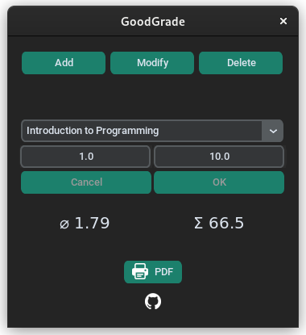
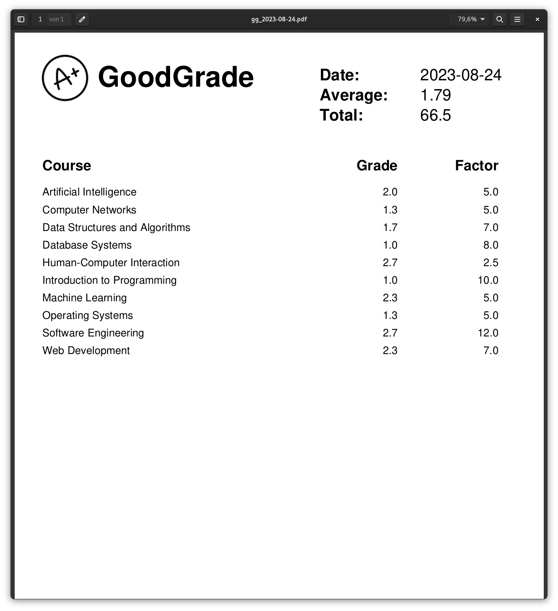

# GoodGrade

## Easy-to-use desktop application that helps students manage their grades and export a list as a PDF file.

## Features
- __Add and change grades__
- __See current average grade__
- __Saved for future sessions__
- __List of all grades as a PDF__

## Installation
1. Clone the repository to your local machine
2. Install the required dependencies by running `pip install -r requirements.txt`
3. Run the app using `python main.py` (optionally package with [pyinstaller.sh](pyinstaller.sh) and make it executable)

or visit the [download page](https://fabianjuelich.xyz/goodgrade) to download the executables for Windows and Linux

## Usage
1. E.g. to add a grade, click the "Add" button to enter the Insert-mode (Similar procedure for other modes)
2. Enter a course and a grade (factor is optional) and click "OK" (Repeat for all grades and exit mode by pressing "Cancel")
4. The application will automatically calculate the average grade
5. Press the "PDF" button to print a list of all grades in PDF format (or select one in the drop down menu for insight)

## Screenshots

## Credits
- https://github.com/TomSchimansky/CustomTkinter
- https://github.com/PyFPDF/fpdf2
- https://github.com/gnikit/tkinter-tooltip
- https://icons8.com