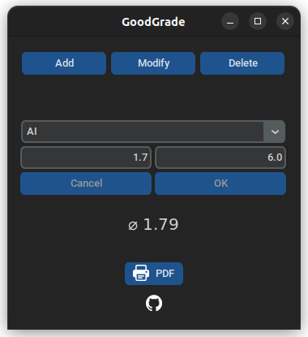
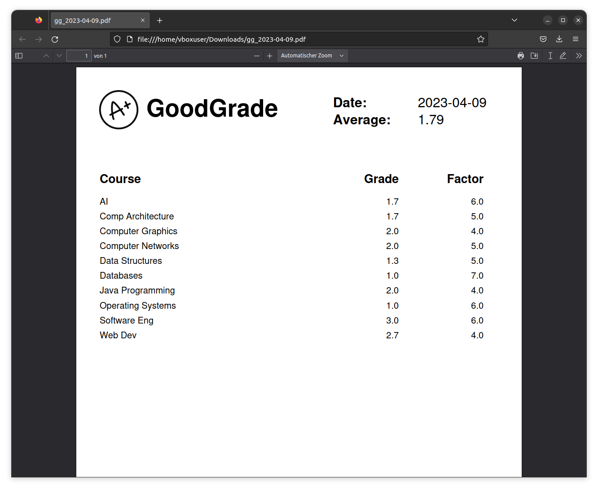

# GoodGrade

GoodGrade is a user-friendly desktop application that helps students manage their grades. It also has the functionality to calculate the average grade and export the list of grades as a PDF file.

## Features

- Input, modify and delete grades
- Get the current average grade
- Save grades for future sessions
- Print a list of all grades as a PDF

## Installation

1. Clone the repository to your local machine
2. Install the required dependencies by running `pip install -r requirements.txt`
3. Run the app using `python main.py` (optionally package with [pyinstaller.sh](pyinstaller.sh) and make it executable)

or visit the [download page](https://fabianjuelich.xyz/goodgrade) to download the executables for Windows and Linux

## Usage

1. To add a grade, click the "Add" button to enter the Insert-mode (Similar procedure for other modes)
2. Enter a course and a grade (factor is optional) in the input fields and click "OK" to add it to the list
3. Repeat step 2 for all grades
4. The application will automatically calculate the average grade
5. Press the "PDF" button to print a list of all grades in PDF format

## Screenshots

## Credits

- https://github.com/TomSchimansky/CustomTkinter
- https://github.com/PyFPDF/fpdf2
- https://github.com/gnikit/tkinter-tooltip
- https://icons8.com